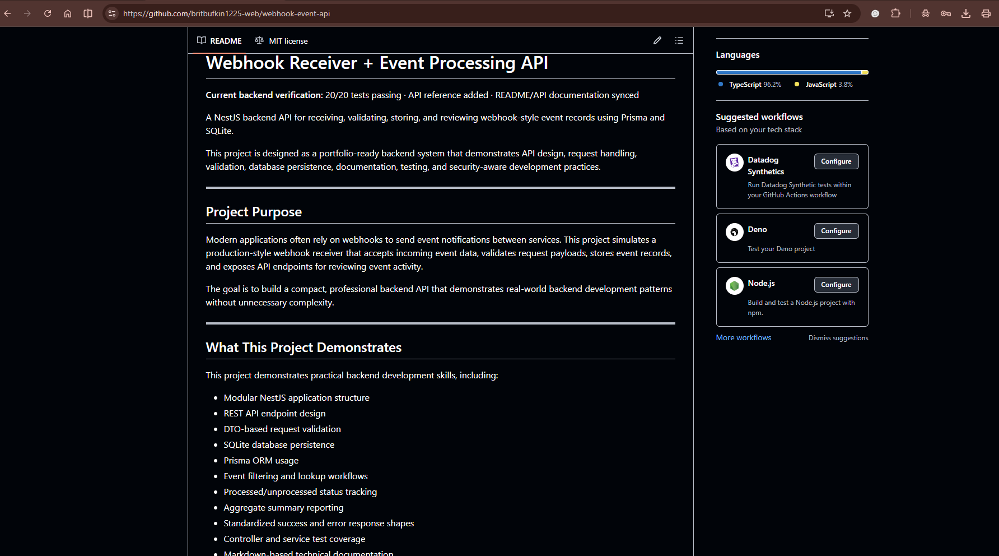
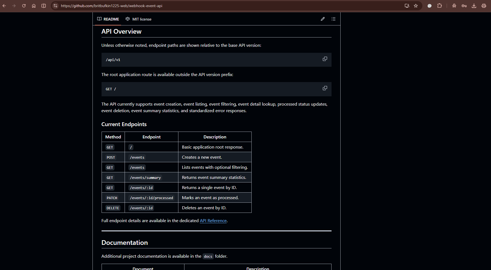
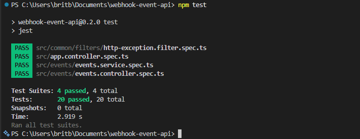
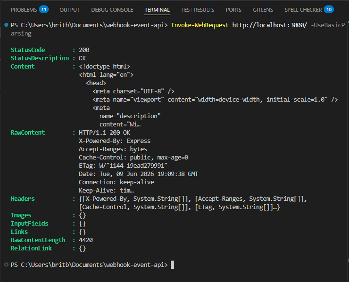
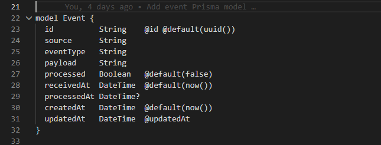

# Webhook Receiver + Event Processing API

**Current backend verification:** 20/20 tests passing · API reference added · README/API documentation synced

A NestJS backend API for receiving, validating, storing, and reviewing webhook-style event records using Prisma and SQLite.

This project is designed as a portfolio-ready backend system that demonstrates API design, request handling, validation, database persistence, documentation, testing, and security-aware development practices.

---

## Project Purpose

Modern applications often rely on webhooks to send event notifications between services. This project simulates a production-style webhook receiver that accepts incoming event data, validates request payloads, stores event records, and exposes API endpoints for reviewing event activity.

The goal is to build a compact, professional backend API that demonstrates real-world backend development patterns without unnecessary complexity.

---

## What This Project Demonstrates

This project demonstrates practical backend development skills, including:

* Modular NestJS application structure
* REST API endpoint design
* DTO-based request validation
* SQLite database persistence
* Prisma ORM usage
* Event filtering and lookup workflows
* Processed/unprocessed status tracking
* Aggregate summary reporting
* Standardized success and error response shapes
* Controller and service test coverage
* Markdown-based technical documentation
* Git-based project workflow and repository hygiene

---

## Project Status

Current status: **Portfolio-ready checkpoint**

This project has reached a stable v0.2.0 closeout checkpoint. Core backend functionality, API documentation, test coverage, and local verification have been completed.

Development is currently paused at a clean portfolio-ready state. Future improvements may include authentication, pagination, dashboard views, deployment configuration, and expanded webhook provider examples.

### Current Verification Status

| Check                                                | Status     |
| ---------------------------------------------------- | ---------- |
| Test suite                                           | 20/20 PASS |
| Test suites                                          | 4/4 PASS   |
| API reference documentation                          | Added      |
| README/API documentation                             | Synced     |
| Git working tree after latest documentation workflow | Clean      |

---

## Verification Status

The project is currently verified through automated testing, documentation review, and clean repository status checks.

### Latest Verification Checkpoint

| Area                         | Result    |
| ---------------------------- | --------- |
| Unit and controller tests    | PASS      |
| Service logic tests          | PASS      |
| Error response documentation | Updated   |
| API reference documentation  | Added     |
| README API section           | Updated   |
| README/API consistency audit | Completed |
| Git working tree             | Clean     |

### Verification Summary

The Webhook Receiver + Event Processing API currently has passing test coverage for the implemented backend feature set, including event creation, event retrieval, filtering, processed-status updates, summary behavior, validation handling, and standardized error responses.

Current verification result:

```text
Test suites: 4/4 PASS
Tests: 20/20 PASS
Git working tree: clean
Documentation status: updated
Backend code changes made: none

## Version

Current version: **v0.2.0**

Base API version: `/api/v1`

Version `v0.1.0` represents the initial working backend foundation, including event creation, event retrieval, filtering, detail lookup, processed status updates, event deletion, summary reporting, standardized error responses, documentation updates, and test coverage.

---

## Core Features

### Implemented

* Basic application root response
* Webhook-style event creation
* Request payload validation
* SQLite database persistence
* Event history retrieval
* Event filtering by query parameters
* Event detail lookup
* Event processed/unprocessed status tracking
* Event deletion
* Event summary reporting
* Event summary aggregation by processing status, source, and event type
* Standardized event API response structure
* Standardized API error response structure
* Not-found handling for missing events
* Bad-request handling for invalid query filters
* Geofence database model foundation
* Environment variable configuration
* Structured project documentation
* Jest-based testing workflow
* Events controller test coverage
* Events service test coverage

### Planned

* Expanded CRUD documentation
* Event type classification
* Request logging improvements
* Security-conscious request handling improvements
* Expanded testing documentation
* Database schema notes
* Development workflow notes

---

## Tech Stack

| Area            | Technology   |
| --------------- | ------------ |
| Runtime         | Node.js      |
| Framework       | NestJS       |
| Language        | TypeScript   |
| Database        | SQLite       |
| ORM             | Prisma       |
| Testing         | Jest         |
| Documentation   | Markdown     |
| Version Control | Git + GitHub |

---

## API Overview

Unless otherwise noted, endpoint paths are shown relative to the base API version:

```text
/api/v1

The root application route is available outside the API version prefix:

```text
GET /
```

The API currently supports event creation, event listing, event filtering, event detail lookup, processed status updates, event deletion, event summary statistics, and standardized error responses.

### Current Endpoints

| Method   | Endpoint                | Description                           |
| -------- | ----------------------- | ------------------------------------- |
| `GET`    | `/`                     | Basic application root response.      |
| `POST`   | `/events`               | Creates a new event.                  |
| `GET`    | `/events`               | Lists events with optional filtering. |
| `GET`    | `/events/summary`       | Returns event summary statistics.     |
| `GET`    | `/events/:id`           | Returns a single event by ID.         |
| `PATCH`  | `/events/:id/processed` | Marks an event as processed.          |
| `DELETE` | `/events/:id`           | Deletes an event by ID.               |

Full endpoint details are available in the dedicated [API Reference](docs/API_REFERENCE.md).

---

## Documentation

Additional project documentation is available in the `docs` folder.

| Document                                                                             | Description                                                                                               |
| ------------------------------------------------------------------------------------ | --------------------------------------------------------------------------------------------------------- |
| [API Reference](docs/API_REFERENCE.md)                                               | Full endpoint reference, request examples, response shapes, filtering options, and standard error format. |
| [Documentation Index](docs/README.md)                                                | Index of available project documentation.                                                                 |
| [Environment Variables](docs/environment-variables.md)                               | Environment variable setup notes.                                                                         |
| [Project Overview](docs/project-overview.md)                                         | Higher-level project overview and purpose.                                                                |
| [Session 7.5 — Documentation and Repository Polish](docs/session-7-5-repo-polish.md) | Earlier documentation and repository polish notes.                                                        |

---

## Portfolio Screenshots

### README Overview



### API Reference



### Tests Passing



### API Response



### Prisma Schema



---

## Database Models

Current Prisma models include:

* `Event`
* `Geofence`

### Event Model

The `Event` model stores incoming webhook-style records and tracks basic event metadata.

Current event fields include:

* `id`
* `source`
* `eventType`
* `payload`
* `processed`
* `receivedAt`
* `processedAt`
* `createdAt`
* `updatedAt`

### Geofence Model

The `Geofence` model supports location-based records with coordinates, radius, active status, and timestamps.

Current geofence fields include:

* `id`
* `name`
* `description`
* `latitude`
* `longitude`
* `radius`
* `isActive`
* `createdAt`
* `updatedAt`

Geofence API routes are not currently exposed in the application source code.

---

## Testing Status

Current test status:

* Test suites: 4 passed / 4 total
* Tests: 20 passed / 20 total

### Current Tested Areas

* App controller default behavior
* Events controller response handling
* Events controller response metadata
* Events controller query validation
* Events controller delete response handling
* Events service creation behavior
* Events service list retrieval behavior
* Events service filtering behavior
* Events service single-record lookup behavior
* Events processed status update behavior
* Events delete behavior
* Events not-found error handling
* Event summary aggregation behavior
* Standardized error response behavior

### Run Tests

```bash
npm test
```

---

## Getting Started

### Install Dependencies

```bash
npm install
```

### Configure Environment Variables

Create a local `.env` file based on the example file:

```bash
cp .env.example .env
```

### Run Database Setup

```bash
npx prisma migrate dev
```

### Start the Development Server

```bash
npm run start:dev
```

### Run the Test Suite

```bash
npm test
```

---

## Repository Structure

```text
webhook-event-api/
├── docs/           # Project documentation
├── generated/      # Generated Prisma client output
├── prisma/         # Prisma schema and migrations
├── src/            # NestJS application source code
├── test/           # Test files
├── .env.example    # Example environment variables
├── README.md       # Project overview
└── package.json    # Project scripts and dependencies
```

---

## Portfolio Value

This project is intended to demonstrate:

* Backend API structure
* Modular NestJS architecture
* Request and response handling
* Consistent API response design
* Consistent API error response design
* Database-backed event storage
* Prisma ORM usage
* SQLite persistence
* Environment configuration
* DTO-based validation
* Query parameter filtering
* Error handling patterns
* CRUD-style endpoint design
* Testable service and controller design
* Professional documentation habits
* Security-aware backend thinking

---

## Current Limitations

* Geofence API routes are planned but not currently exposed.
* Authentication and authorization are not yet implemented.
* Request logging and audit-style tracking are planned future improvements.
* The project currently uses SQLite for local development and portfolio demonstration.

---

## Future Improvements

Planned improvements include:

* Expanded CRUD endpoint documentation
* Request logging
* Authentication or API key protection
* Expanded validation coverage
* Geofence controller and service implementation
* Additional database documentation
* Expanded testing notes
* Deployment notes
* Example API usage scripts

---

## Development Notes

This project is being built in small, documented sessions. Each session focuses on one clear improvement so the repository remains clean, understandable, and easy to review.

Private local workflow notes and shorthand references are intentionally excluded from version control.

---

## License

This project is licensed under the terms included in the repository license file.